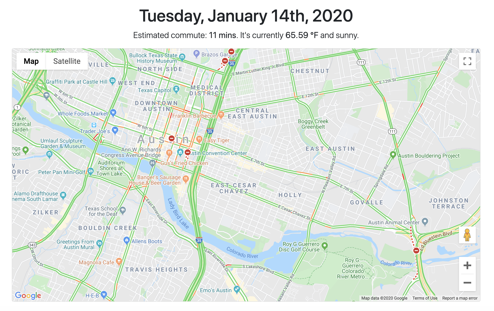

# PiBase
PiBase is a personal news hub and start page designed to be hosted on the Raspberry Pi.

# Features
## Traffic & Weather Overview 

## Display Themes

## Personalized Newsfeed

## Weather Forecast

# Prerequisites
## 1. Google Maps API Key 
&nbsp;&nbsp;&nbsp;&nbsp; Get a GoogleMaps API Key: https://developers.google.com/maps/documentation/javascript/get-api-key

## 2. OpenWeatherMap API Key
&nbsp;&nbsp;&nbsp;&nbsp; Get an OpenWeatherMap API Key: https://openweathermap.org/appid

## 3. Twitter API Key and Access Token
&nbsp;&nbsp;&nbsp;&nbsp; Get Twitter API Key and Access Token: https://developer.twitter.com/en/apply-for-access

## 4. Existing web server installation (PHP, MySQL, phpMyAdmin)
&nbsp;&nbsp;&nbsp;&nbsp; Install a Web Server on Raspberry Pi: https://howtoraspberrypi.com/how-to-install-web-server-raspberry-pi-lamp/

# Installation & Setup
## 1. Clone repo to web server
&nbsp;&nbsp;&nbsp;&nbsp; **a.)** Navigate to your root web directory (if you followed the web server tutorial above, this is probably `/var/www/html/`)

&nbsp;&nbsp;&nbsp;&nbsp; **b.)** Run `git clone https://github.com/bradomics/pibase.git` in your terminal

## 2. Import pibase.sql
&nbsp;&nbsp;&nbsp;&nbsp; **a.)** In your browser, go to `localhost/phpmyadmin` and log in to phpMyAdmin

&nbsp;&nbsp;&nbsp;&nbsp; **b.)** Click the 'Import' tab at the top of the page. On the Import page, click 'Choose File' and find the `pibase.sql` file at `pibase/db/pibase.sql`. Select the file `pibase.sql` for import.

&nbsp;&nbsp;&nbsp;&nbsp; **c.)** Leave default settings selected, and click the 'Go' button located at the bottom left of the screen. If you experience an error during the first attempt to import `pibase.sql`, repeating steps a., b., and c. one more time should solve the issue.

## 3. Update database credentials in `/db/config.php`
&nbsp;&nbsp;&nbsp;&nbsp; **a.)** Open `db/config.php` in your code editor

&nbsp;&nbsp;&nbsp;&nbsp; **b.)** Note: if you chose to use default MySQL credentials during installation, you won't need to edit this file. If you did update your MySQL password during installation, edit line 4 to reflect your new password. 

## 4. Save API Keys
&nbsp;&nbsp;&nbsp;&nbsp; **a.)** In your browser, go to `localhost/pibase/settings.php`. Once the page is loaded, find and click on the 'API Keys' tab.

&nbsp;&nbsp;&nbsp;&nbsp; **b.)** Enter your API Keys and Access Tokens for each service and click 'Save'

